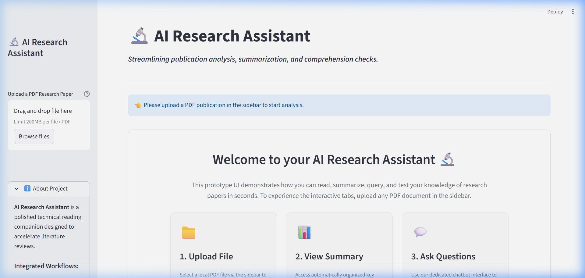
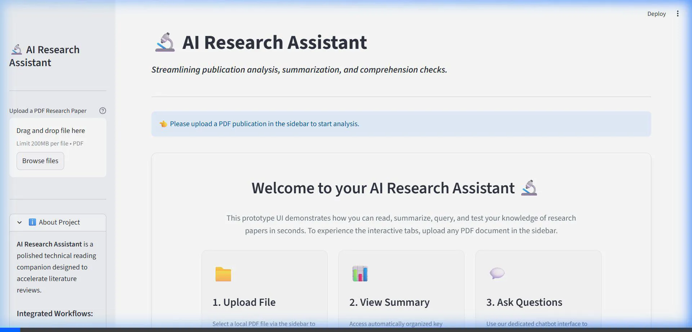
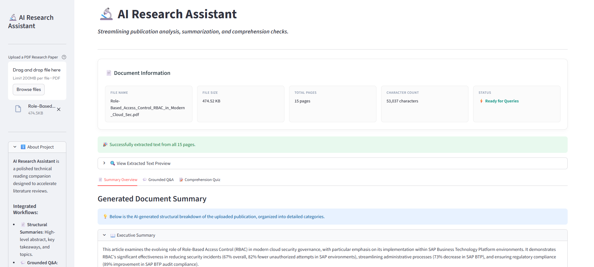
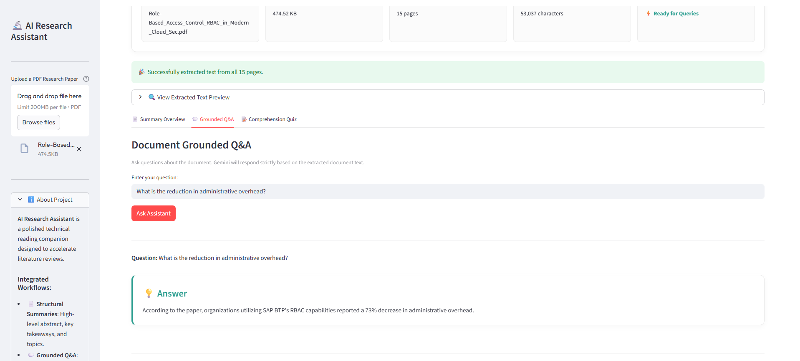

# 🔬 AI Research Assistant

AI Research Assistant is a simple and clean Streamlit application that helps you read and understand PDF research papers and technical documents. Powered by the Google Gemini API, it extracts text, generates summaries, answers questions, and creates interactive quizzes.

---

## 📸 Screenshots & Working Demo

### Application Layout
Here is the clean and modern landing page of the application:



### Working Demo
See how the application parses PDFs and extracts information:



### Research Paper Analysis & Q&A Screenshots
Here are screenshots of the application analyzing the uploaded cloud security RBAC research paper and answering contextual questions:





---

## 🔍 Example Analysis: Role-Based Access Control (RBAC) Research Paper
Below is the actual output generated by the application when analyzing the paper: *“Role-Based Access Control (RBAC) in Modern Cloud Security Governance: An In-depth Analysis”* by Arun Kumar Akuthota (IT Caps LLC).

### 📄 Document Summary Output

#### 1. Executive Summary
> This article provides an in-depth analysis of Role-Based Access Control (RBAC) in modern cloud security governance, with a specific focus on its application within SAP Business Technology Platform environments. It illustrates RBAC's evolution from a traditional mechanism into an AI-enhanced security framework, capable of addressing complex cloud challenges. The analysis demonstrates RBAC's significant effectiveness in reducing security incidents (67% overall, 82% fewer unauthorized attempts in SAP environments), streamlining administrative processes (73% decrease in SAP BTP), and ensuring regulatory compliance (89% improvement in SAP BTP audit compliance). The integration of AI and ML capabilities is highlighted for enhancing threat detection, optimizing role management, and improving organizational efficiency. The article also provides insights into best practices, the impact on risk management and scalability, and explores the convergence of RBAC with emerging technologies like blockchain and zero trust architecture for a forward-looking perspective on cloud security.

#### 2. Key Takeaways
* **Security Incident Reduction**: RBAC is a fundamental cornerstone of cloud security governance, demonstrating a 67% reduction in security incidents when properly implemented.
* **AI-Enhanced Protection**: AI-enhanced RBAC, particularly in SAP BTP, significantly improves security by leveraging machine learning to detect and mitigate access violations with high accuracy, leading to 82% fewer unauthorized access attempts.
* **Operational Efficiencies**: Effective RBAC implementation leads to substantial operational efficiencies, including a 73% decrease in administrative overhead and an 89% improvement in audit compliance rates.
* **Least Privilege Access**: The principle of Least Privilege Access is crucial, demonstrating a 94.6% reduction in attack surface and preventing 99.3% of potential privilege escalation attempts.
* **Dynamic Security Policies**: Modern RBAC systems integrate with contextual authentication factors to enable dynamic security policies that adapt to user behavior and threat intelligence.

#### 3. Important Topics Covered
* Role-Based Access Control (RBAC)
* Cloud Security Governance
* SAP Business Technology Platform (SAP BTP)
* Artificial Intelligence (AI) and Machine Learning (ML) in Security
* Least Privilege Access & Just-in-Time Access Provisioning
* Zero Trust Architecture & Blockchain Integration

---

### 📝 Generated Comprehension Quiz

1. **According to the abstract, what is a key aspect of how RBAC has transformed in modern cloud security governance?**
   - [ ] It has been replaced by traditional access control mechanisms.
   - [x] **It evolved into an AI-enhanced security framework.**
   - [ ] It primarily focuses on reducing operational costs without security improvements.
   - [ ] It is no longer relevant for SAP Business Technology Platform environments.

2. **What significant improvement did organizations utilizing RBAC capabilities in SAP Business Technology Platform report regarding administrative overhead?**
   - [ ] A 67% reduction in security incidents.
   - [ ] An 89% improvement in audit compliance rates.
   - [x] **A 73% decrease in administrative overhead.**
   - [ ] An 82% fewer unauthorized access attempts.

3. **What are the three primary entities around which the foundational structure of RBAC in cloud environments revolves?**
   - [ ] Customers, products, and services.
   - [x] **Users, roles, and permissions.**
   - [ ] Servers, networks, and databases.
   - [ ] Policies, regulations, and audits.

4. **According to the document, what reduction in attack surface has the implementation of least privilege access principles demonstrated?**
   - [ ] 79.5% fewer data breach incidents.
   - [ ] 99.3% prevention of privilege escalation attempts.
   - [ ] 87.2% decrease in security incident response times.
   - [x] **94.6% reduction in attack surface.**

5. **How have RBAC frameworks evolved to address the dynamic and ephemeral nature of resources in cloud-native architectures like microservices and containerization?**
   - [ ] By reverting to traditional static access control lists.
   - [x] **By integrating automation, policy-as-code principles, and container orchestration platforms.**
   - [ ] By exclusively relying on manual access management efforts.
   - [ ] By focusing solely on on-premises infrastructure security.

---

## ✨ Key Features
- **📄 PDF Text Ingestion**: Upload any PDF file to extract all text content automatically.
- **📊 Auto Summarization**: Get a structured Executive Summary, Key Takeaways, and list of Important Topics.
- **💬 Grounded Q&A**: Ask questions and get answers based strictly on the document text.
- **📝 Comprehension Quiz**: Take a 5-question multiple-choice quiz to test your understanding.
- **⚡ Smart Caching**: Caches summaries and quizzes so the app remains fast and responsive.

---

## 🛠️ Tech Stack
- **Python**: Core programming language.
- **Streamlit**: Web interface framework.
- **Google Gemini API**: Generates summaries, Q&A responses, and quizzes.
- **PyPDF2**: Extracts text from PDF files.
- **python-dotenv**: Manages configuration keys.

---

## 📁 Project Structure
- [app.py](file:///c:/Users/User/.gemini/antigravity-ide/scratch/ai_research_assistant/app.py): The main Streamlit web application.
- [ai_service.py](file:///c:/Users/User/.gemini/antigravity-ide/scratch/ai_research_assistant/ai_service.py): Service code for calling the Google Gemini API.
- [pdf_processor.py](file:///c:/Users/User/.gemini/antigravity-ide/scratch/ai_research_assistant/pdf_processor.py): Utility code to extract text from PDF files.
- [utils.py](file:///c:/Users/User/.gemini/antigravity-ide/scratch/ai_research_assistant/utils.py): Styling and layout helper functions.
- [requirements.txt](file:///c:/Users/User/.gemini/antigravity-ide/scratch/ai_research_assistant/requirements.txt): List of Python packages required for the project.

---

## 🚀 How to Run the Project

### 1. Install dependencies
```bash
pip install -r requirements.txt
```

### 2. Configure API Key
Create a file named `.env` in the project root directory and add your Google Gemini API key:
```env
GEMINI_API_KEY=your_gemini_api_key_here
```

### 3. Run the application
```bash
streamlit run app.py
```

---

## 📈 Future Enhancements
- Support for uploading multiple documents.
- Adding vector search (RAG) to handle extremely long books.
- Exporting quiz scores and summary text.

---

## 📄 License
This project is open-source and licensed under the MIT License.
